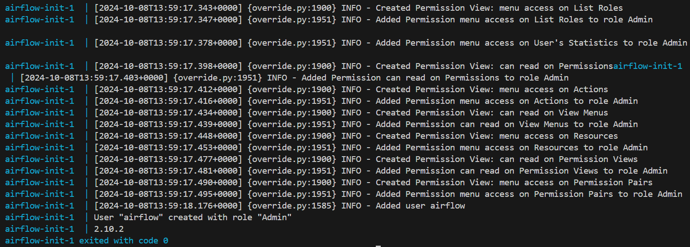
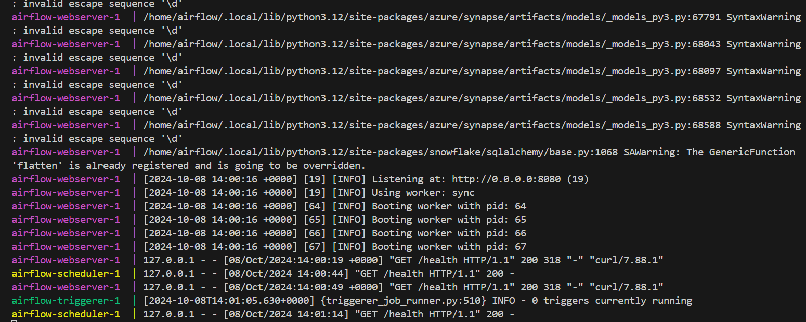
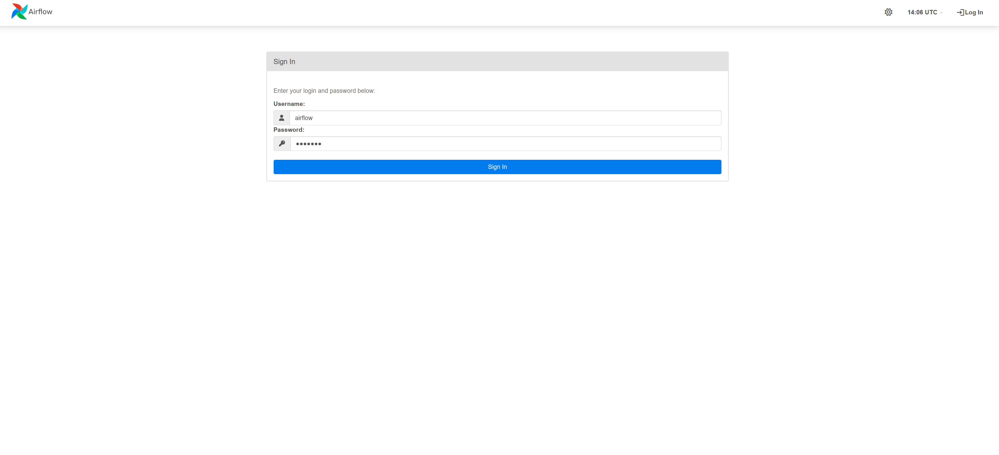
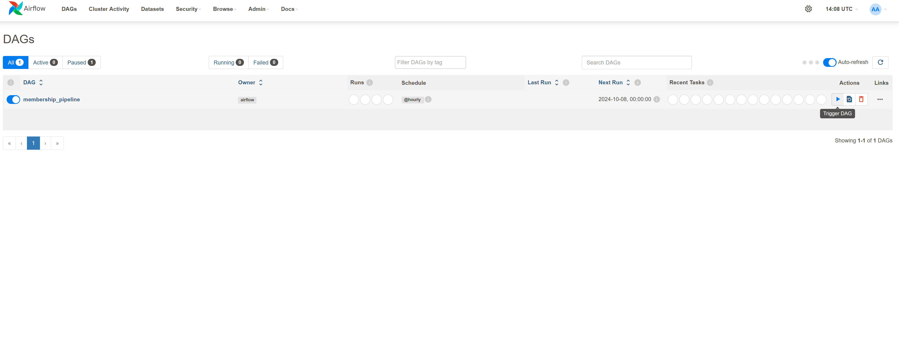
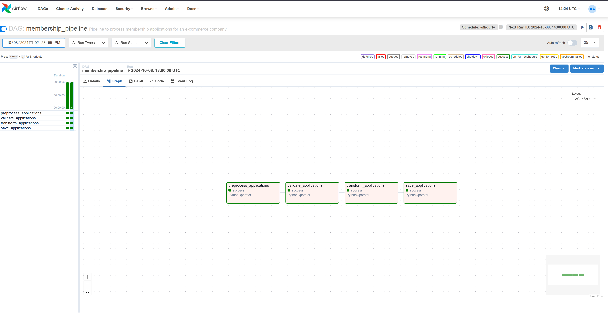
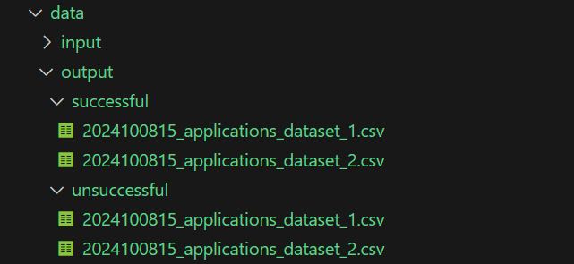

# Section1: Data Pipelines

# Solution

The data pipeline is built in the form of an Airflow DAG scripted in python to preprocess, validate, transform, and save the data. An airflow container will be set up to execute the DAG.

# Project Structure
|Path|Description|
|:---|:----------|
|`dags/validation_pipeline.py`|Main pipeline script|
|`data/input/`|Input data folder|
|`data/output/`|Ouput data folder. Have 2 subdirectories `successful` and `unsuccessful`|
|`Dockerfile`|Docker file (to set up airflow)|
|`docker-compose.yml`|Docker compose file (to set up airflow)|


# Usage

The data pipeline requires Python and Docker to run and assumes these two components are installed and available.

## Initialize airflow docker image

To initialize the airflow docker image, run
```
docker compose up airflow-init
```

To run the airflow docker container, run
```
docker compose up
```


Now a localhosted airflow service will be accessible via localhost:8080. The default username and password are both airflow (for production usage a stricter secret control is necessary. The default secrets will be used for simplicity)



We will be able to view the DAG in the web UI. Then the DAG is manually triggered.


When the DAG finished executing the output data will be stored in data/output/



# Pipeline Explanation

## Docker Configuration

In this project the default [docker-compose](https://airflow.apache.org/docs/apache-airflow/2.10.2/docker-compose.yaml) provided by Apache Airflow is adopted with modifications.

1. Volume mounting
```
volumes:
    - ${AIRFLOW_PROJ_DIR:-.}/dags:/opt/airflow/dags
    - ${AIRFLOW_PROJ_DIR:-.}/logs:/opt/airflow/logs
    - ${AIRFLOW_PROJ_DIR:-.}/config:/opt/airflow/config
    - ${AIRFLOW_PROJ_DIR:-.}/plugins:/opt/airflow/plugins
    - ${AIRFLOW_PROJ_DIR:-.}/data/input:/opt/airflow/data/input
    - ${AIRFLOW_PROJ_DIR:-.}/data/output/successful:/opt/airflow/data/output/successful
    - ${AIRFLOW_PROJ_DIR:-.}/data/output/unsuccessful:/opt/airflow/data/output/unsuccessful
```
Folders used in the pipeline are mounted to be accessible in the container

2. Disable examples
```
AIRFLOW__CORE__LOAD_EXAMPLES: 'false'
```
This config is set to false to diable loading examples to prevent overflowing with example DAGs.

## DAG Explanation
The DAG is composed of four Python Operators to preprocess, validate, transform, and save the data. It is set to have a start time of 2024-10-08 with 1 auto-retry, while disabling catchup to prevent older instances from being initiated.

```python
default_args = {
    "owner": "airflow",
    "depends_on_past": False,
    "start_date": datetime(2024, 10, 8),
    "retries": 1,
}

dag = DAG(
    "membership_pipeline",
    default_args=default_args,
    description="Pipeline to process membership applications for an e-commerce company",
    schedule_interval="@hourly",
    catchup=False
)

preprocess_task = PythonOperator(
    task_id="preprocess_applications",
    python_callable=preprocess_applications,
    dag=dag,
)

validate_task = PythonOperator(
    task_id="validate_applications",
    python_callable=validate_applications,
    dag=dag,
)

transform_task = PythonOperator(
    task_id="transform_applications",
    python_callable=transform_applications,
    provide_context=True,
    dag=dag,
)

save_task = PythonOperator(
    task_id="save_applications",
    python_callable=save_applications,
    dag=dag,
)

preprocess_task >> validate_task >> transform_task >> save_task
```

### Preprocessing

```python
# preprocess_applications reads all data from the input folder and store it in the global variable applications
def preprocess_applications(**context):
    all_data = []
    for filename in os.listdir(input_folder):
        if filename.endswith(".csv"):
            file_path = os.path.join(input_folder, filename)
            try:
                df = pd.read_csv(file_path)
                df["source_file"] = filename  # Track where data came from
                all_data.append(df)
            except Exception as e:
                print(f"Error processing file {file_path}: {e}")
    if all_data:
        applications = pd.concat(all_data, ignore_index=True)

    context["ti"].xcom_push(key="applications", value=applications)
```
Read data is passed to the next operator via xcom.

## Validate

```python
# validate_applications filters successful applications based on the given criteria
def validate_applications(**context):
    df = context["ti"].xcom_pull(key="applications")

    def validate_application(row):
        # if mobile number is not 8 digits, return False
        if not (row["mobile_no"].isdigit() and len(row["mobile_no"]) == 8):
            return False

        # if no birthday is given, or age is under 18, return False
        if pd.isnull(row["date_of_birth"]):
            return False
        else:
            birthdate = pd.to_datetime(row["date_of_birth"], errors="coerce")
            age = (datetime(2022, 1, 1) - birthdate).days / 365.25
            if age <= 18:
                return False

        # if email does not end in @emailprovider.com or @emailprovider.net, return False
        email_pattern = r"^[a-zA-Z0-9._%+-]+@[a-zA-Z0-9.-]+\.(com|net)$"
        if not re.match(email_pattern, row["email"]):
            return False
        return True

    successful_apps = df[df.apply(validate_application, axis=1)].copy()
    unsuccessful_apps = df[~df.apply(validate_application, axis=1)].copy()

    context["ti"].xcom_push(key="successful_apps", value=successful_apps)
    context["ti"].xcom_push(key="unsuccessful_apps", value=unsuccessful_apps)
```

In this step, applications are validated based on three criteria:
1. mobile number must be an 8-digit number
2. date of birth must be non-null and the applicant must be above 18 years old
3. email must have a valid address and end with either .com or .net

Then the data is split into successful applications and uncessful applications.

## Transform

```python
# transform_applications transform relevant fields according to specifications
def transform_applications(**context):
    def remove_salutations(name):
        # Some names start with salutations. We'll need to remove them to retrieve first and last name. The salutations in this list is not exhaustive, although sufficient in covering cases from input data
        salutations = ["Mr.", "Ms.", "Mrs.", "Dr.", "Prof.", "Rev."]
        name_parts = name.split()
        if name_parts[0] in salutations:
            name_parts.pop(0)
        return " ".join(name_parts)

    def create_membership_id(row):
        last_name = row["last_name"]
        birthdate_str = row["date_of_birth"]
        hash_obj = sha256(str(birthdate_str).encode())
        short_hash = hash_obj.hexdigest()[:5]
        return f"{last_name}_{short_hash}"

    df = context["ti"].xcom_pull(key="successful_apps")
    df["name"] = df["name"].apply(remove_salutations)

    # Remove any rows which do not have a name field (treat this as unsuccessful applications)
    # Determine rows with null names before drop
    null_name_apps = df[df["name"].isnull()].copy()
    df = df.dropna(subset=["name"])
    # Append null name apps to unsuccessful apps
    unsuccessful_apps = context["ti"].xcom_pull(
        key="unsuccessful_apps"
    )  # pull unsuccessful applications
    unsuccessful_apps = pd.concat([unsuccessful_apps, null_name_apps])

    # Process the name column to remove salutations and then split
    name_split = df["name"].str.split(" ", n=1, expand=True)
    df["first_name"] = name_split[0]
    df["last_name"] = name_split[1]

    # Format date of birth into YYYYMMDD
    df["date_of_birth"] = pd.to_datetime(
        df["date_of_birth"], errors="coerce"
    ).dt.strftime("%Y%m%d")

    # Create a new field named above_18 based on the applicant's birthday
    df["above_18"] = (
        datetime(2022, 1, 1)
        - pd.to_datetime(df["date_of_birth"], format="%Y%m%d", errors="coerce")
    ).dt.days / 365.25 > 18

    # Create membership ID
    df["membership_id"] = df.apply(create_membership_id, axis=1)

    # Save the result
    successful_apps = df.copy()
    context["ti"].xcom_push(key="successful_apps", value=successful_apps)
    context["ti"].xcom_push(key="unsuccessful_apps", value=unsuccessful_apps)
```

In the data, some names have saluations, so they are removed before split names into first name and last name.

It then filter out records that don't have names and merge them with uncessful applications from the previous step (Though specified in the qustion statement, a better solution would be dropping the data with null names in the validation task).

Then date of birth is formatted to yyyyMMdd, `above_18` field is added, and the membership_id field is added.

## Save
```python
def save_applications(**context):
    successful_apps = context["ti"].xcom_pull(key="successful_apps")
    unsuccessful_apps = context["ti"].xcom_pull(key="unsuccessful_apps")  # Pull unsuccessful applications

    for filename, data in [
        (output_folder_success, successful_apps),
        (output_folder_fail, unsuccessful_apps),
    ]:
        try:
            grouped = data.groupby("source_file")
            for source_file, group in grouped:
                output_path = os.path.join(filename, context['dag_run'].start_date.strftime('%Y%m%d%H_' + source_file))
                try:
                    group.drop(columns="source_file").to_csv(output_path, index=False)
                    print(f"Successfully saved {source_file} to {output_path}")
                except Exception as e:
                    print(f"Error saving {source_file}: {e}")  # Log the specific error for this file
        except Exception as e:
            print(f"Error processing data for output folder {filename}: {e}")  # Log error for data processing

```

In the last task, transformed data is saved into respective folders with runtime in hours as file prefix to indicate they are the output of an hourly pipeline.
