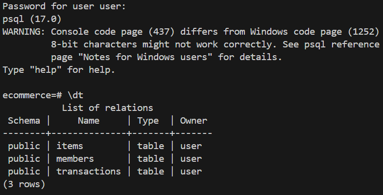
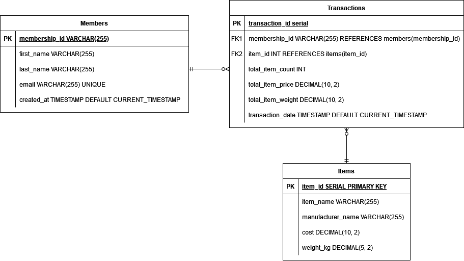

# Section2: Databases

# Solution

The data pipeline is built in the form of an Airflow DAG scripted in python to preprocess, validate, transform, and save the data. An airflow container will be set up to execute the DAG.

# Project Structure
|Path|Description|
|:---|:----------|
|`Dockerfile`|DOckerfile to build the image and run the container|
|`setup.sql`|Script to create required tables|
|`query1.sql` and `query2.sql`| Required queries to solve the problem stated|


# Usage

We will run a postgresql container from the latest postgres image. It is assumed that docker and psql is installed on the machine.

## Build the image

In the Dockerfile, we copied setup.sql to ` /docker-entrypoint-initdb.d/` so it will be automatically run when the container starts.

To build the docker image, run
```
docker build -t ecommerce_postgres .
```

To run the container, run
```
docker run -d \
  --name ecommerce_postgres_container \
  -e POSTGRES_DB=ecommerce \
  -e POSTGRES_USER=user \
  -e POSTGRES_PASSWORD=password \
  -p 5432:5432 \
  ecommerce_postgres
```

If the container is stopped during the process, run this to start the container
```
docker start ecommerce_postgres_container
```

Then run `psql -h localhost -U user -d ecommerce` to access the postgresql database. The default password is `password`.

In the CLI interface of postgresql, run `\dt` to view craeted tables.



# DDL Explanation

The database will have three tables, with 2 dimension tables (Item and Members) and 1 fact table (Transactions).

1. Items
```sql
CREATE TABLE items (
    item_id SERIAL PRIMARY KEY,
    item_name VARCHAR(255),
    manufacturer_name VARCHAR(255),
    cost DECIMAL(10, 2),
    weight_kg DECIMAL(5, 2)
)
```
Items table has 5 columns

    1. item_id: Self-incremental primary key
    2. item_name: Name of the item
    3. manufacturer_name: Name of the manufacturer
    4. cost: Cost of the item in 2 decimal places
    5. weight_kg: Weight of the item in kg in 2 decimal places

2. Members
```sql
CREATE TABLE members (
    membership_id VARCHAR(255) PRIMARY KEY,
    first_name VARCHAR(255),
    last_name VARCHAR(255),
    email VARCHAR(255) UNIQUE,
    created_at TIMESTAMP DEFAULT CURRENT_TIMESTAMP
);
```

Members table has 5 columns

    1. membership_id: Membership ID generated in section 1
    2. first_name: First name of the member
    3. last_name: Last name of the member
    4. email: Email of the member
    5. created_at: Timestamp that the member is created in the database for engineering purpose

3. Transactions

```sql
CREATE TABLE transactions (
    transaction_id SERIAL PRIMARY KEY,
    membership_id VARCHAR(255) REFERENCES members(membership_id),
    item_id INT REFERENCES items(item_id),
    total_item_count INT,
    total_item_price DECIMAL(10, 2),
    total_item_weight DECIMAL(10, 2),
    transaction_date TIMESTAMP DEFAULT CURRENT_TIMESTAMP
);
```

Transaction table has 6 columns

    1. transaction_id: ID of the transaction
    2. membership_id: Membership ID that placed the order. References membership_id in members table
    3. item_id: Item ID of the item bought
    4. total_item_count: Number of items in the transaction
    5. total_item_price: Total item price in the transaction
    6. total_item_weight: Total item weight in the transaction
    7. transaction_date: Date that the transaction was made

# Queries

## Query1
```sql
SELECT
    members.membership_id,
    members.first_name,
    members.last_name,
    members.email,
    top_members_by_spending.total_spending
FROM
(
    SELECT
        transactions.membership_id,
        sum(total_item_price) AS total_spending
    FROM
        transactions
    GROUP BY
        membership_id
    ORDER BY
        sum(total_item_price) DESC
    LIMIT 10
) AS top_members_by_spending
LEFT JOIN members
    ON top_members_by_spending.membership_id = members.membership_id;
```

## Query2
```
SELECT
    items.item_id,
    items.item_name,
    items.manufacturer_name,
    items.cost,
    items.weight_kg,
    top_item_by_total_item_count.total_item_count
FROM
(
    SELECT
        transactions.item_id,
        sum(total_item_count) AS total_item_count
    FROM
        transactions
    GROUP BY
        item_id
    ORDER BY
        sum(total_item_count) DESC
    LIMIT 10
) AS top_item_by_total_item_count
LEFT JOIN items
    ON top_item_by_total_item_count.item_id = items.item_id;
```

# ER diagram



Here Members and Items will both have a 1 to 0 or Many relationships towards Transactions.