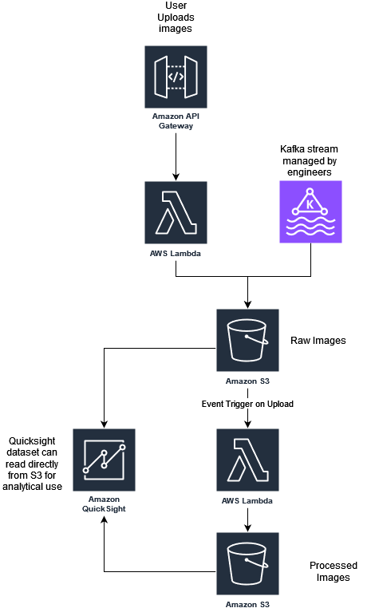

# Problem Statement

To develop a robust and scalable cloud infrastructure for the company's image processing business, I'll use AWS (Amazon Web Services) due to its extensive portfolio of services and built-in best practices. Below is a high-level system architecture diagram outlining the end-to-end flow of the pipeline, satisfying the given requirements and addressing stakeholder concerns.

# Architecture Components

1. Image Uploads 
    
    - Web Application: Users can upload images through a web application.
    - API Gateway: Acts as an entry point for the image uploading API, ensuring scalability and security.
    - Lambda Function: Handles the image upload, placing raw images into an initial S3 Bucket (raw images).
    - Kafka Stream: Managed by Amazon MSK (Managed Streaming for Apache Kafka), which will also place images into the S3 raw images bucket.

2. Raw Image Storage

    - Amazon S3: Images are uploaded to an S3 bucket, which serves as a scalable object storage solution. Objects can be stored with metadata, allowing for easy retrieval and analysis.
    - Event Trigger: An S3 event triggers further processing through Lambda.

3. Image Processing
    
    - AWS Lambda: The existing image processing code is hosted on AWS Lambda for serverless execution. This service processes the images as they are uploaded.

4. Processed Image Storage
    
    - Amazon S3: Stores processed images.

5. Business Intelligence

    - AWS QuickSight: Connects to the processed images and metadata stored in S3 for analytical computation.

6. Compliance
    
    - S3 Lifecycle Policies: S3 lifecycle rules automatically delete images and their metadata after 7 days, ensuring compliance with privacy regulations. This policy will be set for both raw and processed images

# Addressed Concerns

1. Managability

Managed services (like MSK, Lambda, S3) minimize maintenance overhead, allowing engineers to focus on development.

2. Scalability

The architecture is designed to scale with demand using auto-scaling and managed services like S3 and MSK to handle peaks without incurring high costs.

AWS CloudWatch: Monitoring and logging services to keep track of resource utilization and set alarms for unusual activity.

3. Security

AWS IAM: Role-based access control ensures the least privilege principle is enforced for users and services.
AWS KMS: Key Management Service is used for encrypting data at rest, and HTTPS ensures data is encrypted in transit.

4. Availability & Disaster Recovery

Multi-AZ Deployments: Ensure high availability by deploying resources in multiple availability zones.

S3 Versioning: Enable versioning on S3 buckets to retain copies of files, aiding in recovery from accidental deletions.

5. Elasticity

By leveraging S3, Lambda, and Auto Scaling, the architecture can elastically expand or contract based on traffic demands, ensuring optimal resource utilization and cost-efficiency.

6. Efficiency

Serverless technologies like Lambda and Athena enable the company to only pay for what it uses, reducing costs related to idle resources.

7. Low Latency

Using Amazon S3 for image storage ensures high-speed retrieval with minimal latency.

8. Least Privilege

IAM Fine-Grained Access: All users, applications, and services are assigned only the minimum level of permissions needed to perform their tasks. IAM roles are used to segregate access between different environments (e.g., development, production).